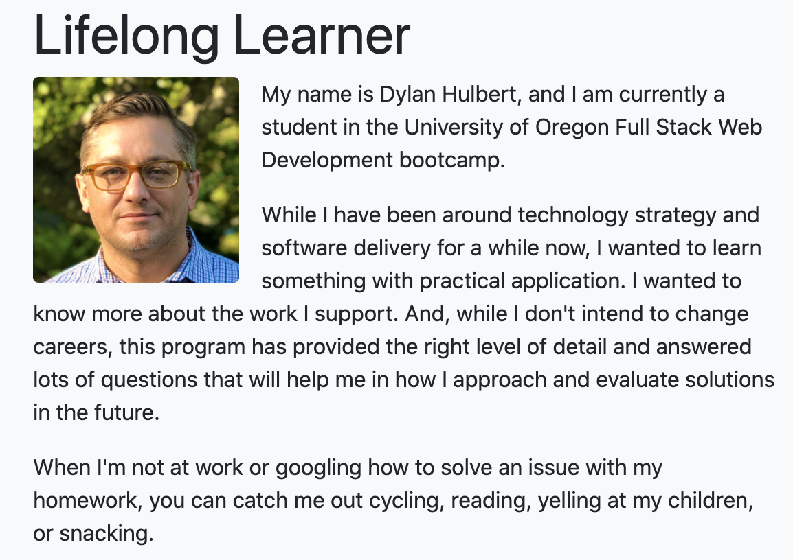

## dylanhulbert.github.io
I created the contents of this repo as homework for my Bootcamp at UofO

## Personal Portfolio
The objective of this homework was to create a professional portfolio of the work we've completed in the course, provide contact information, and link to a resume.  

I'll continue to evolve this throughout the bootcamp.

## Technologies
* [Bootstrap](https://getbootstrap.com/)

## Future Improvements
* Contact Form - Simple, Bootstrap native mailto form
* Navigation Improvements - Fix the smooth scrolling and change color in Nav Bar to contrast with page background
* PDF modal - Resume pop-up, rather than brower URL
* Larger text - More Bootstrap native improvements

## Link(s)
You can view my portfolio at [dylanhulbert.github.io](https://dylanhulbert.github.io).

